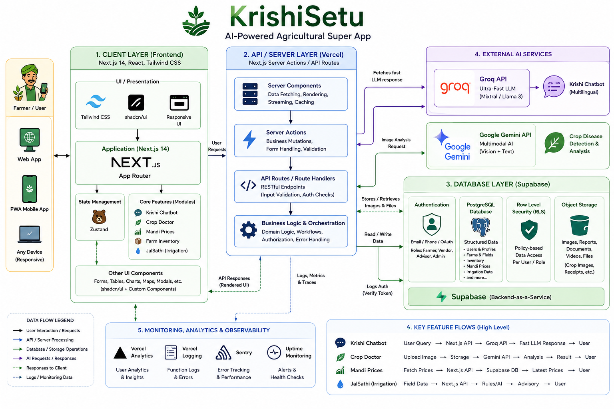

<div align="center">
  
  <br/>
  <h1>🌾 KrishiSetu (कृषि सेतु)</h1>
  <p><strong>Your Intelligent AI Farming Partner</strong></p>
  
  <p>
    <a href="https://nextjs.org/"></a>
    <a href="https://supabase.com/"></a>
    <a href="https://groq.com/"></a>
    <a href="https://deepmind.google/technologies/gemini/"></a>
    <a href="https://tailwindcss.com/"></a>
    <a href="https://www.typescriptlang.org/"></a>
  </p>

  <p>Empowering Indian farmers with real-time data, cutting-edge AI diagnostics powered by Groq & Gemini, and multilingual support.</p>

  <p align="center">
    <a href="#-overview">Overview</a> •
    <a href="#-architecture">Architecture</a> •
    <a href="#-key-features">Features</a> •
    <a href="#-tech-stack">Tech Stack</a> •
    <a href="#-getting-started">Getting Started</a>
  </p>
</div>

---

## 📖 Overview

**KrishiSetu** (meaning "Farming Bridge") is an enterprise-grade, mobile-first web application designed specifically for Indian farmers. It leverages dual artificial intelligence models—**Groq** for lightning-fast multilingual reasoning and **Google Gemini** for multimodal computer vision—to provide actionable insights, crop disease diagnostics, live market prices, and personalized farming schedules. 

Built with modern web technologies, KrishiSetu delivers a native-app-like experience that works flawlessly on budget smartphones, even under low-bandwidth rural networks.

---

## 🏛️ Architecture

KrishiSetu relies on a modern, decoupled architecture connecting a Next.js App Router client with Supabase for data persistence and external AI APIs for intelligent inference.

<div align="center">
  
  <br/>
  <i>KrishiSetu High-Level System Architecture</i>
</div>

---

## ✨ Key Features

### 🤖 Multilingual AI Intelligence
- **Krishi Chatbot (Powered by Groq)**: Blazing fast, context-aware chatbot supporting English, Hindi, Kannada, Telugu, Tamil, and Marathi. Includes voice dictation and TTS.
- **AI Crop Doctor (Powered by Gemini)**: Upload photos of diseased crops directly from the mobile camera. Instantly receive accurate diagnostics and organic/chemical treatment recommendations.

### 📈 Smart Farming Tools
- **Live Mandi Prices**: Real-time and historical market prices across Indian states with visual trend graphs.
- **Smart Crop Planner**: Track fields, calculate harvest dates, and get a dynamic timeline for plowing, sowing, watering, and harvesting.
- **JalSathi (Smart Irrigation)**: Advisory on when to run pumps based on localized weather, soil moisture, and rain forecasts.

### 🚜 Farm Management
- **Krishi Marketplace**: P2P platform for buying/selling crops, seeds, and equipment without middlemen.
- **Digital Majdoor (Labor Management)**: Manage farm laborers, track attendance, and log daily wages and advances seamlessly.
- **Inventory Tracking**: Manage stock levels for seeds, fertilizers, and pesticides with low-stock alerts.
- **Government Schemes Explorer**: Discover eligible agricultural schemes (PM-KISAN, etc.) with step-by-step guides.

### 📱 100% Mobile Optimized Experience
- Built explicitly for 320px–430px screens commonly used in rural areas.
- "Offline-aware" capability with automatic reconnection banners.

---

## 🛠️ Tech Stack

| Category | Technologies |
| --- | --- |
| **Frontend Framework** | [Next.js 14](https://nextjs.org/) (App Router), React 18 |
| **Language** | [TypeScript](https://www.typescriptlang.org/) |
| **Styling & UI** | [Tailwind CSS](https://tailwindcss.com/), Framer Motion, shadcn/ui |
| **Database & Auth** | [Supabase](https://supabase.com/) (PostgreSQL + RLS Policies, Storage) |
| **AI Inference Engine** | **Groq API** (LPU for fast text) & **Google Gemini API** (Multimodal vision) |
| **Icons & Data Viz** | Lucide React, Recharts, Leaflet (Maps) |
| **Deployment & Analytics**| Vercel, Vercel Analytics |

---

## 🚀 Getting Started

### Prerequisites
- Node.js 18.x or later
- Supabase Account & Project
- Groq API Key & Google Gemini API Key

### 1. Clone the repository
```bash
git clone https://github.com/yourusername/krishisetu.git
cd krishisetu
```

### 2. Install dependencies
```bash
npm install
# or
yarn install
```

### 3. Setup Environment Variables
Create a `.env.local` file in the root directory:

```env
# Next.js App URL
NEXT_PUBLIC_APP_URL=http://localhost:3000

# Supabase Keys
NEXT_PUBLIC_SUPABASE_URL=your_supabase_project_url
NEXT_PUBLIC_SUPABASE_ANON_KEY=your_supabase_anon_key
SUPABASE_SERVICE_ROLE_KEY=your_supabase_service_role_key

# AI API Keys
GROQ_API_KEY=your_groq_api_key
GEMINI_API_KEY=your_gemini_api_key

# Govt Data API (Optional)
DATA_GOV_API_KEY=your_data_gov_api_key
```

### 4. Setup Database schema
Navigate to your Supabase SQL Editor and run `supabase/schema.sql`.

### 5. Run the Development Server
```bash
npm run dev
```
Open [http://localhost:3000](http://localhost:3000) in your browser. 

---

## 📂 Project Structure

```text
krishisetu/
├── app/                  # Next.js App Router Pages
│   ├── (auth)/           # Login & Signup flows
│   ├── (dashboard)/      # Protected dashboard routes (Chat, Mandi, Planner, etc.)
│   ├── api/              # Backend API routes (Chat, Profile, Scrapers)
│   └── globals.css       # Core styling & mobile utility classes
├── components/           # Reusable UI Components
│   ├── home/             # Landing page sections
│   ├── layout/           # Header, Sidebar, and mobile BottomNav
│   └── ui/               # Base components (Loaders, OfflineBanner)
├── lib/                  # Utilities (Supabase client, AI APIs, Voice processing)
├── public/               # Static assets (icons, splash screens, architecture diagram)
├── stores/               # Zustand state management
└── supabase/             # SQL schemas & DB migrations
```

---

<div align="center">
  <i>Built with ❤️ for the farmers of India.</i>
  <br/>
  <b>Developed by Prajwal P Raikar</b>
</div>
